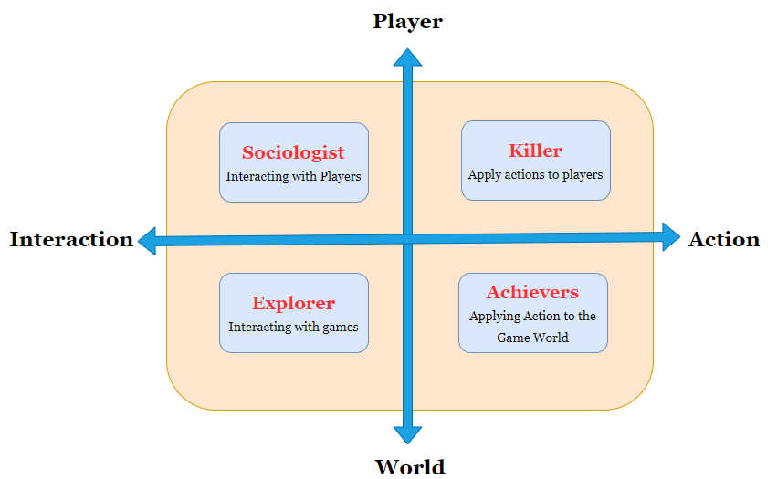
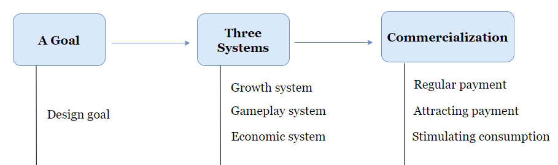
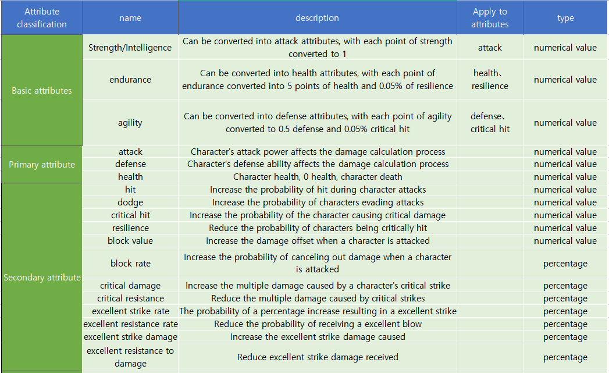
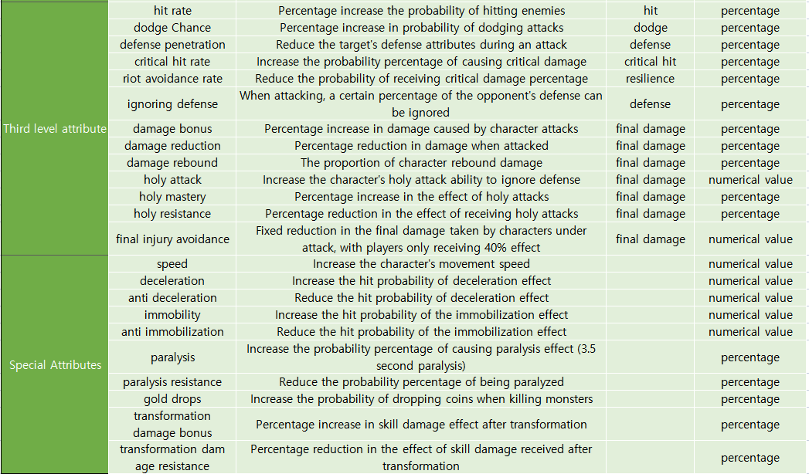
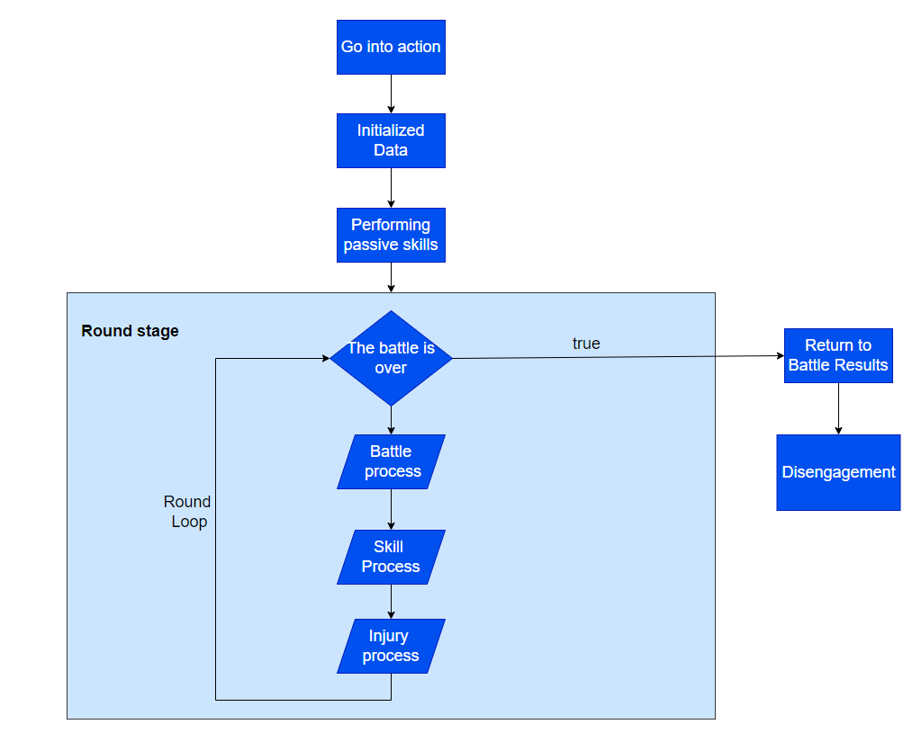

# 游戏制作指北
English version|[Chinese version]( ./README.md)
## Description
Game production theory, the content is compiled, translated, and drawn by myself. This content has been translated from Chinese to English using translation tools. If there are any translation errors, please feel free to correct them.

### Game Type
1. Role-playing game（RPG）
    - Traditional role-playing
    - MMORPG

2. Action Game（ACT）
3. Adventure Game（AVG）
    - Individual survival
    - Open world

4. Fight Technology Game（FTG）
5. Sport Game（SPT）
6. Race Game（RAC）
7. Simulation Game（SLG）
8. Shooting game（STG）
9. Music Game（MSC）
10. Card Game（CAG）
11. GalGame（GAL）
12. H-Game
13. Computer Role-Playing Game（C-Game）
14. Multiplayer Online Battle Arena（Moba)

### Game Theme
Common game themes: magic, fantasy, martial arts, the Three Kingdoms, crossing, palace fighting, war, anime, etc.

What do players most expect? What do players care most about?

Divide players into four categories:

    - Killer: Willing to interfere with the operation of the gaming world or the gaming experience of other players.

    - Achievers: Willing to overcome various challenges in the gaming world and accumulate achievements.

    - Explorer: Willing to explore the workings of the gaming world.

    - Sociologist: Willing to share stories from the gaming world with other players and establish social relationships.

### Game breadth

The magnitude of game types introduced in the game, such as combat, strategy, music, and other gameplay.

### Game difficulty

    - Game Mastery Difficulty

    - Game gameplay difficulty

    - Player Growth Difficulty

### Target game
If you don't know where to start, you can refer to this picture

### Attribute Definition

As the foundation of the game, attributes affect the settings of both game combat and game development.

#### General attributes

#### Basic attributes

Games often use the "three dimensions" or "five dimensions" as the basic attributes, which vary depending on the game theme.

-Universal circumference: strength, intelligence, endurance

-Universal circumference: strength, agility, intelligence, endurance, and spirit

-Three Kingdoms Theme: Force, Wisdom, Dominance, Art of War, Constitution

-Martial Arts Theme: System, Roots, Strength, Body Method, and Vitality

#### Primary attribute

The first level attribute is the underlying attribute that directly affects.

-Attacks: physical attacks, magical attacks

-Defense: Physical Defense, Magic Defense

#### Secondary attribute

The second level attribute affects the calculation of single damage, and randomly triggers the second level attribute. If triggered, its combat benefit will increase.

#### Third level attribute

The third level attribute is used to modify the first level or second level attributes to increase balance or a brand new experience.

#### Special attributes

Special attributes are some special attributes introduced based on the type of game.

### Combat Framework

#### Basic combat process

The basic combat process is the process from "entering the battle" to "leaving the battle" state.

**Note: The 'end of battle' state does not equal the end of the battle * *, for example, in World of Warcraft, a single battle must wait for 3 seconds before entering the state of disengagement from the battle.

#### Skill Process

#### Injury process
