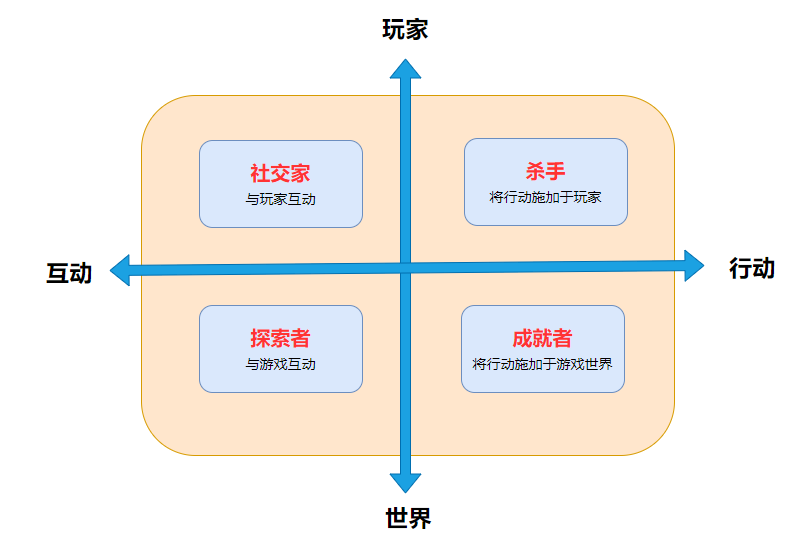
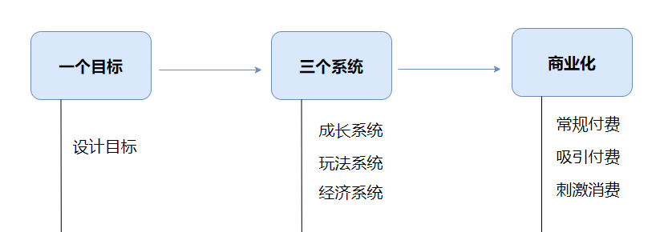
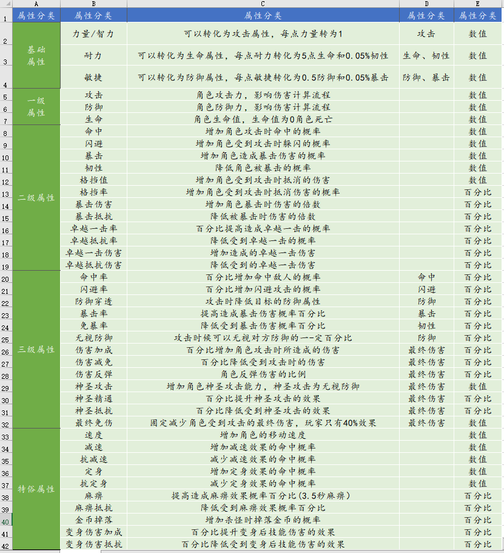
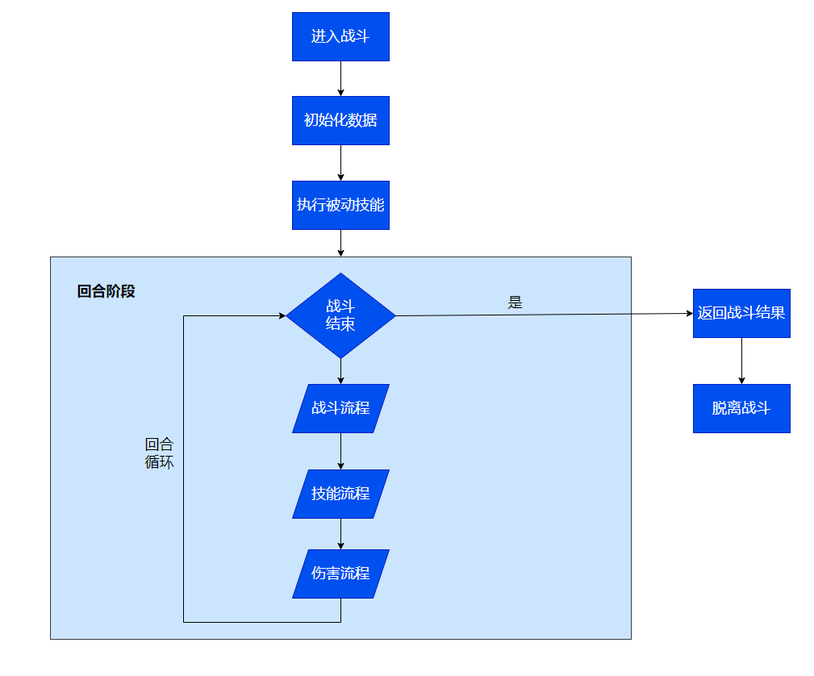

# 游戏制作指北
[英文版]( ./README.en.md)|中文版
## 介绍
游戏制作理论，内容由本人整理、翻译、画图绘制而成。未经允许禁止打印。
## 序
游戏制作分为游戏设计、程序开发、游戏美术三个部分。本页内容隶属于游戏设计。
### 游戏类型

1. 角色扮演游戏（RPG）
    - 传统角色扮演
    - 大型多人在线角色扮演
2. 动作游戏（ACT）
3. 冒险游戏（AVG）
    - 个体生存
    - 开放世界
4. 格斗游戏（FTG）
 5. 体育游戏（SPT）
 6. 竞速游戏（RAC）
 7. 策略游戏（SLG）
 8. 射击游戏（STG）
 9. 音乐游戏（MSC）
 10. 卡牌游戏（CAG）
 11. 美少女游戏（GAL）
 12. 成人游戏（H-Game）
 13. 休闲游戏（C-Game）
 14. 多人竞技游戏（Moba)

### 游戏题材
常见的游戏题材：魔幻、玄幻、武侠、三国、穿越、宫斗、战争、二次元等。

玩家最期待的是什么？玩家最在乎的是什么？

    将玩家分为四类
        - 杀手：乐于干扰游戏世界的运作或其他玩家的游戏体验。
        - 成就者：乐于克服游戏世界中的各种挑战，积累成就。
        - 探索者：乐于探索游戏世界的运作规律。
        - 社交家：乐于与其他玩家分享游戏世界中的故事，建立社交关系。

### 游戏广度
游戏中引入游戏类型的量级，比如游戏包含格斗、策略、音乐等玩法。

### 游戏难度
    - 游戏上手难度
    - 游戏玩法难度
    - 玩家成长难度

### 目标游戏
如果不知道从何下手，可借鉴此图

### 属性定义
属性作为游戏根基，影响了游戏战斗和游戏养成两个方面的设定。

#### 基础属性
游戏常采用“三围”或“五围”作为基础属性，因游戏题材的不同而不同。

- 通用三围:力量、智力、耐力
- 通用五围:力量、敏捷、智力、耐力、精神
- 三国题材：武力、智谋、统御、兵法、体质
- 武侠题材：体制、根骨、力道、身法、元气

#### 一级属性
一级属性是直接作用的底层属性。
- 攻击：物理攻击、魔法攻击
- 防御：物理防御、魔法防御

#### 二级属性
二级属性影响单次伤害计算，随机触发二级属性，如果触发其战斗收益会变高。

#### 三级属性
三级属性用于修正一级属性或二级属性，以增加平衡性或全新体验。

#### 特殊属性
特殊属性是基于游戏类型而引的一些特殊属性。

### 战斗框架
#### 基础战斗流程
基础战斗流程为从“进入战斗”到“脱离战斗”状态的过程。

 **注意：“结束战斗”状态不等于战斗结束**，比如《魔兽世界》单场战斗结束后需要等待3秒才进入脱离战斗的状态。 

#### 技能流程
#### 伤害流程